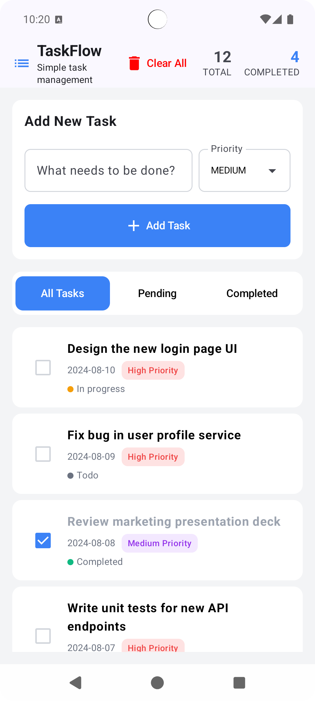

# TaskFlow

TaskFlow is a **simple yet powerful task management app** built with **Clean Architecture** and **Jetpack Compose**.  
It helps you stay organized by allowing you to add, filter, prioritize, and track your tasks efficiently.

  

[🎥 Watch Demo](screenshots/taskflow.mov)

---

## ✨ Features

- **Add New Tasks** with a title, priority, and status.
- **Task Filtering** – View **All**, **Pending**, or **Completed** tasks.
- **Priority Management** – High, Medium, and Low priority with color-coded tags.
- **Task Status Indicators** – Quickly identify tasks that are **To-do**, **In Progress**, or **Completed**.
- **Clear All Tasks** – One tap to remove all tasks.
- **Responsive & Modern UI** – Built with **Jetpack Compose** for a smooth, declarative UI experience.
- **Data Persistence** – Save tasks locally with **Room Database**.
- **Clean Architecture** – Modular layers for scalability and maintainability.
- **Dependency Injection** – Powered by **Hilt**.
- **Coroutines + Flow** – Asynchronous and reactive task management.

---

## 🛠 Tech Stack

### **UI Layer**
- **Jetpack Compose** – Modern declarative UI toolkit.
- **Material 3 Components** – For a clean and accessible design.

### **Architecture**
- **Clean Architecture** – Separated layers:
    - **Presentation** – ViewModels, UI State, and Composable screens.
    - **Domain** – Entities, Use Cases, and Repository contracts.
    - **Data** – Local (Room) & Remote (API service) data sources and repository implementation.
- **MVVM (Model-View-ViewModel)** – For state management.

### **Data Layer**
- **Room Database** – Local storage for offline persistence.
- **Retrofit** – For remote API calls.
- **Mappers** – Convert between DTOs, Entities, and Domain models.

### **Utilities**
- **Kotlin Coroutines & Flow** – For async operations and reactive streams.
- **Hilt** – For Dependency Injection.

---

## 📂 Project Structure

